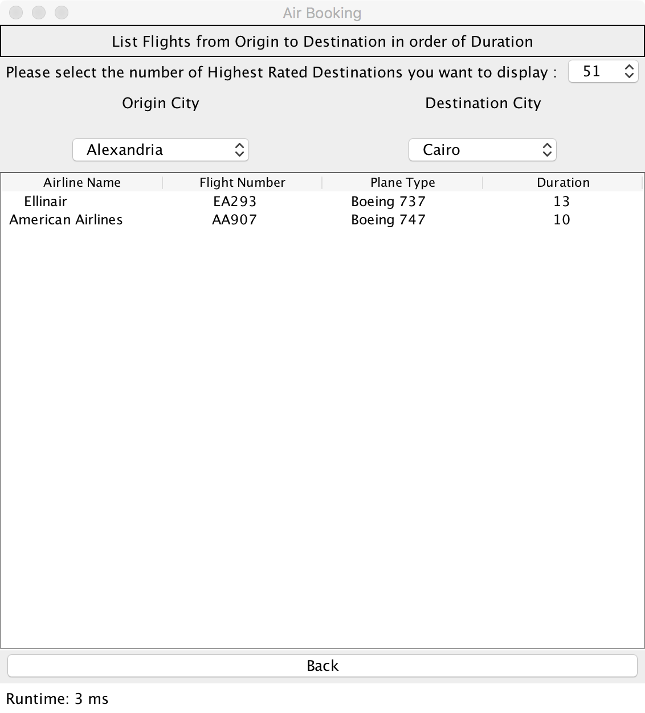

# Airlines Booking System - UCR 2017 Fall CS 166 Final Project
> By
>> Leng Zhang : https://github.com/lengzhang
>> Nelly(Qiwen) Lyu : https://github.com/qlyu001
## Introduction

In this project, with database provided, we built a app, which can help travel agency to book the flights and gather useful information. We no only finished the basic sql application, but also built a user friendly app. In this project, we used java swing as our api.

## How to Build
1. Modify the address of ```airline.csv```, ```bookings.csv```, ```flights.csv```, ```passenger.csv```, and ```ratings.csv``` in ```code/sql/create.sql```;

2. Create a PostgreSQL Database ```flightDB``` with ```code/sql/create.sql```;

3. Use ```code/java/test``` to run the program in Terminal, or use ```code/java/test_GUI``` to run the program with GUI.

## Assumption and Accomplishment

First, we finished nine basic query required for the final project.

> 1. we can insert a passenger into the system. For the pid in this part, we first find the first available empty spot for the pid, and then we assign that value as pid. We did not just assign the pid to the end of the database.

> 2. we can book a flight

> 3. take in the customer review

> 4. it can insert or update flights(finished extra credit)

> 5. it can list the available flights between origin and destination function

> 6. it can list the the most popular destinations

> 7. it can list the highest rated routes

> 8. it can list the flight in order of the duration

> 9. it can find the available seats for flight

For this app, we also built a very user friendly interface, which can dynamically display the useful information. For most of the function related to the origin and destination, our app will provides the existing origin and destination in the database, so users can select the spots easier.

Moreover, we also consider a lot of corner cases. For instance, user can not input a passport number, which is existed in the database.

## Summary

In this project, we finished both the extra credit for query and gui. We learned how to build a actual app using the query methods we learned from the lecture. We also understand how to build a user friendly interface by utilizing java swing.

## GUI Demonstrate

Main Menu


1. 


2. 


3. 


4. 


5. 


6. 


7. 


8. 


9. 


Information.
